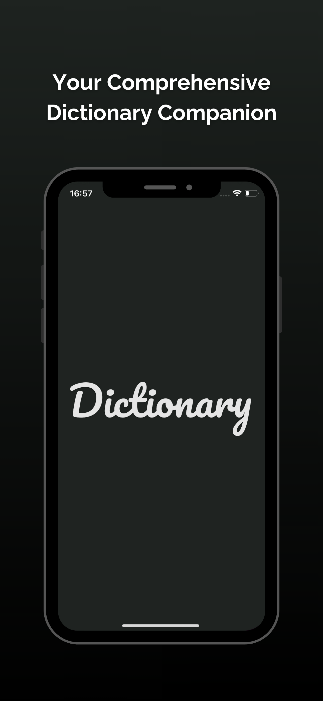
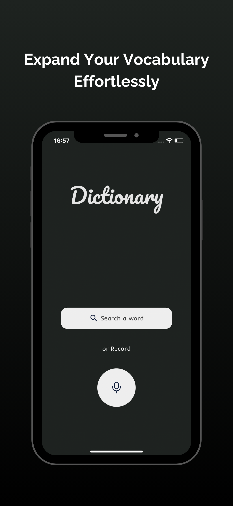
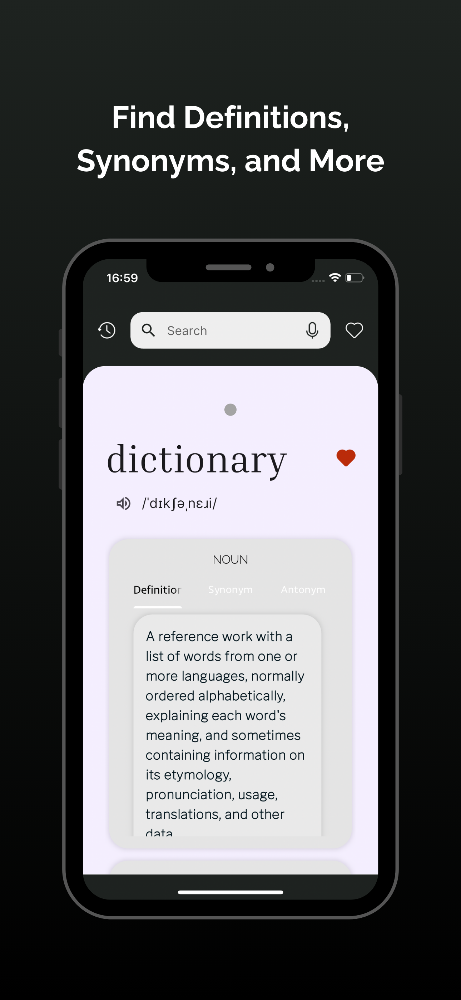
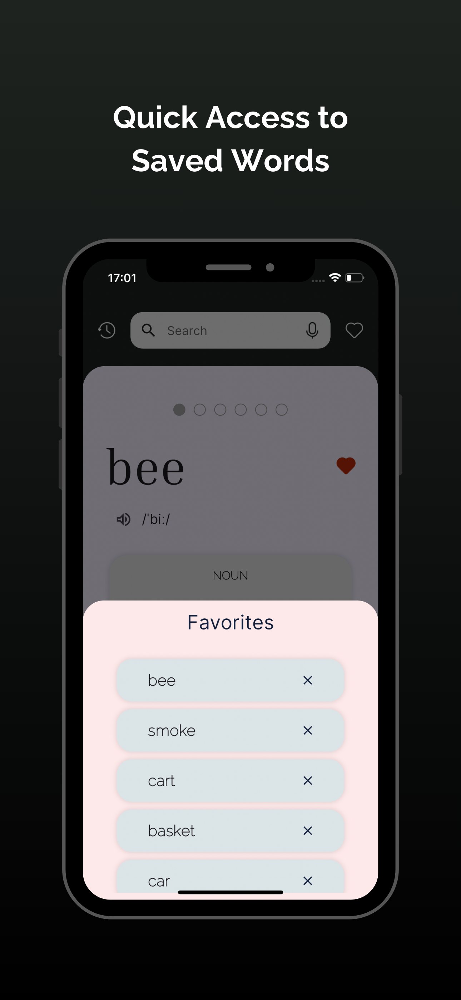
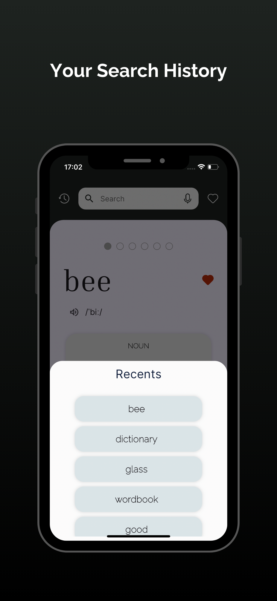
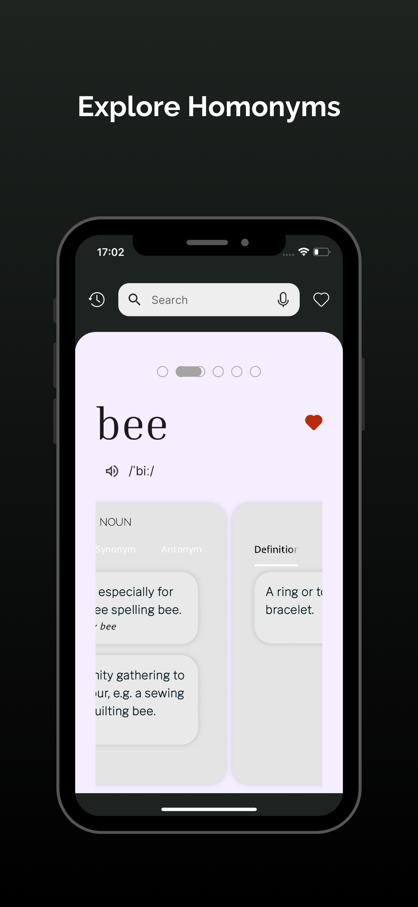
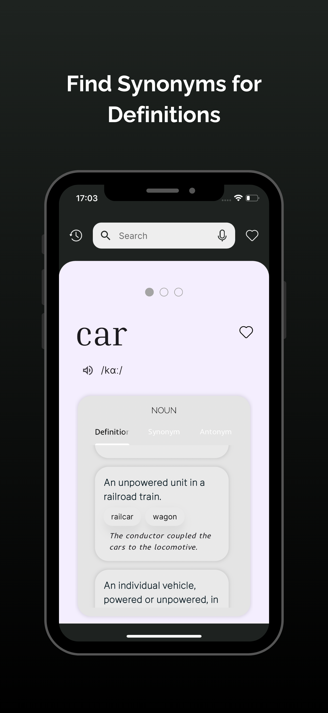
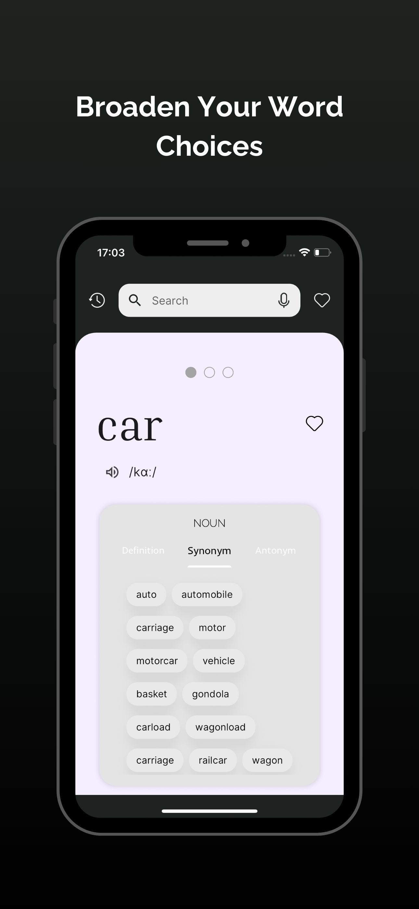
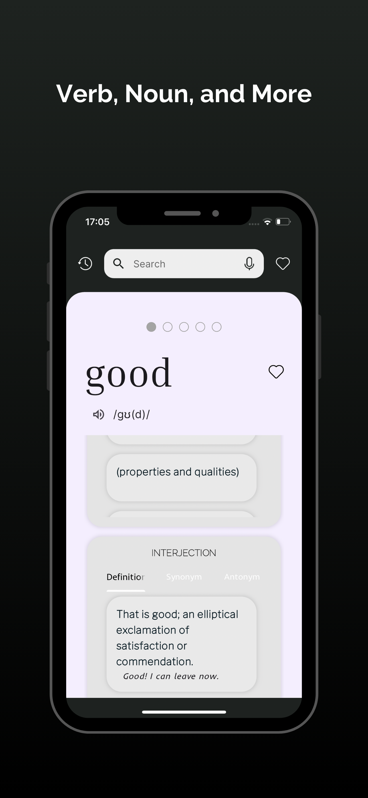

<!DOCTYPE html>
<html lang="en">
<head>
    <meta charset="UTF-8">
    <meta name="viewport" content="width=device-width, initial-scale=1.0">
</head>
<body>

<h1>Dictionary - Simple English</h1>

Welcome to <strong>Dictionary - Simple English</strong>, a powerful and user-friendly app designed to help you discover definitions, synonyms, pronunciations, and much more. Whether you're a student, writer, or language enthusiast, this app will enhance your vocabulary and improve your understanding of the English language.

<h2>Key Features</h2>
<ul>
    <li><strong>Extensive Vocabulary:</strong> Access detailed definitions, synonyms, and antonyms for thousands of words.</li>
    <li><strong>Phonetics and Pronunciations:</strong> Learn correct pronunciations with audio examples and phonetic transcriptions.</li>
    <li><strong>Voice Search:</strong> Easily find words by simply speaking them using the voice search feature.</li>
    <li><strong>Recent Searches:</strong> Quickly revisit and review your recently searched words through the app's history feature.</li>
    <li><strong>Favorites:</strong> Save your favorite words for quick and easy access whenever you need them.</li>
    <li><strong>User-Friendly Interface:</strong> Enjoy a clean, simple, and intuitive experience that is perfect for all age groups.</li>
</ul>

<h2>Why Choose Dictionary - Simple English?</h2>

<strong>Dictionary - Simple English</strong> is more than just a dictionary; it’s your personal vocabulary assistant, available anytime and anywhere. Whether you're preparing for exams, improving your writing skills, or exploring new words, our app helps you unlock the full potential of the English language.

<h2>How It Works</h2>
<ol>
    <li><strong>Launch the App:</strong> Open the app and get started with your language learning journey.</li>
    <li><strong>Search for Words:</strong> Find definitions, synonyms, and more by typing or using voice search.</li>
    <li><strong>Learn and Save:</strong> Save your favorite words for quick access and learn their meanings, pronunciation, and usage.</li>
</ol>

<h2>Download Dictionary - Simple English</h2>

Enhance your vocabulary and understanding of the English language. Download the app now:

<ul>
    <li><a href="https://apps.apple.com/tr/app/dictionary-simple-english/id6535693039" target="_blank">Download on the App Store</a></li>
    <li><a href="https://play.google.com/store/apps/details?id=com.alienproduction.dictionaryapplication" target="_blank">Get it on Google Play</a></li>
</ul>

<h2>Screenshots</h2>

Here are some screenshots of the app in action:

<!-- Add your images here -->

</body>
</html>
